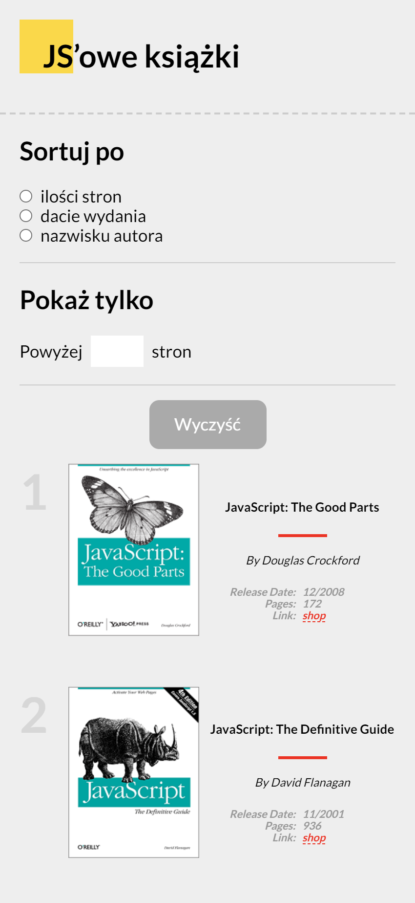

# JS-Books
RWD application showing a collection of books for learning JavaScript. It was written using pure VanillaJS. All sorting and filtering options are self-implemented without using any external frameworks. In addition tests have been written for these functions.  JS-Books was designed using mobile-frist approach and BEM methodology.

## Table of contents
* [Demo](#Demo)
* [Screenshots](#screenshots)
* [Technologies](#technologies)
* [Setup](#setup)
* [Features](#features)

## Demo
Working demo: https://kubar95.github.io/js-books/
## Screenshots

## Technologies
* JavaScript ES6
* Sass
* Webpack
* Mocha / chai

## Setup
$ npm install
$ npm start

## Features
List of features ready and TODOs for future development
* Awesome feature 1
* Awesome feature 2
* Awesome feature 3

To-do list:
* Wow improvement to be done 1
* Wow improvement to be done 2

